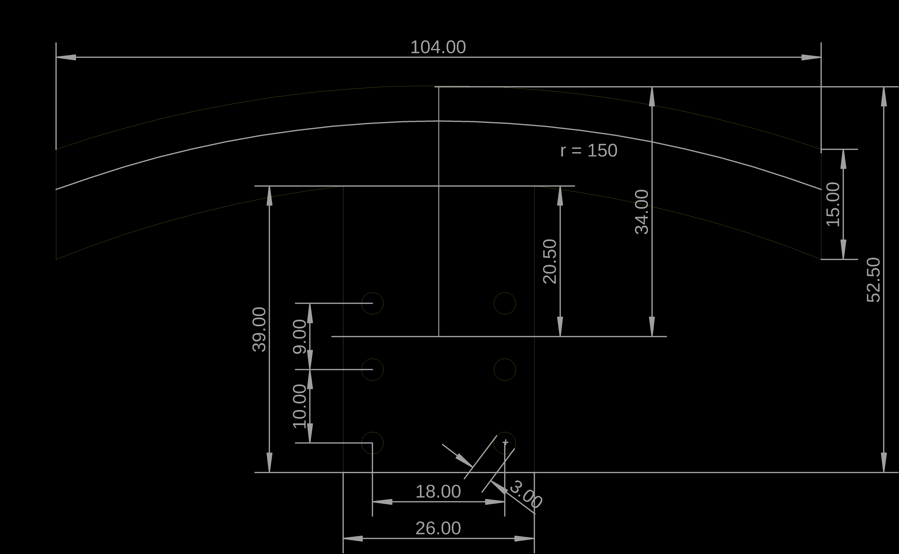
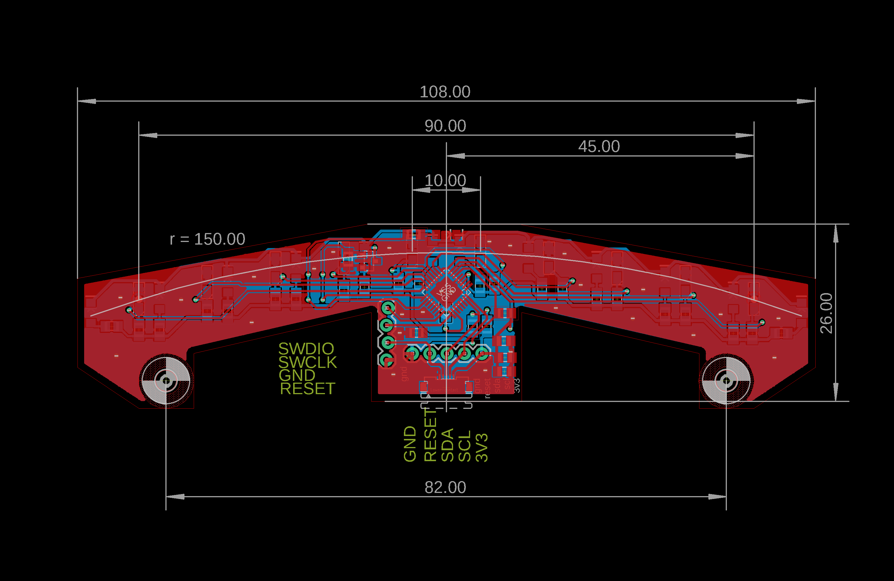

# i2c sensor for line follower

- 10x analog readed sensor
- stm32f051 48MHz arm cortex m0 mcu
- i2c interface, with FFC cable
- uart, swdio availible for debug


# photos

TODO


# hardware basic





# hardware slim




# arduino example - minimal code

link to file : [demo_code](examples/arduino/minimal_test/minimal_test.ino)

## example output 

- device i2c address is 7bit, 0x42
- in setup, program prints readed  who am I, must be readed as **171** (dec 171) if connected correctly
- program prints LS_DIF_FIL_REG reading : filtered differences of on / off leds readings


```bash
who am i reg : 171
0 6 0 0 598 27 3307 3303 3305 3299 
11 6 0 0 560 3 0 0 0 0 
0 2 2 0 594 86 20 7 0 0 
0 3 4 0 594 87 21 7 1 0 
0 4 2 0 594 88 20 5 1 0 
11 5 0 0 562 0 0 0 0 0 
0 3 4 0 596 87 19 7 2 0 
0 6 4 0 594 86 19 6 2 0 
```


# arduino example - full reading

link to file : [demo_code](examples/arduino/full_test/full_test.ino)

## example output

- device i2c address is 7bit, 0x42
- who am I must be readed as **171** (dec 171)
- readings per second : arround 1800 .. 2000, with 100kHz default arduino i2c speed
- readed data :
  - line 1 : led turned off readings, register LS_RAW_OFF_REG
  - line 2 : led turned in readings, register LS_RAW_ON_REG
  - line 3 : led turned off low pass filtered readings, register LS_FIL_OFF_REG
  - line 4 : led turned in low pass filtered readings, register LS_FIL_ON_REG
  - line 5 : raw readings difference, register LS_DIF_RAW_REG
  - line 6 : filtered readings difference, register LS_DIF_FIL_REG
- in practice, only reading from LS_DIF_FIL_REG (or LS_DIF_RAW_REG) is necessary to estimate line position


```bash
who am i reg : 171
readings per second 2000
readed data
1206 1467 1156 1393 3102 1862 1558 1523 1559 1495 
1206 1464 1139 1365 815 1351 1501 1515 1567 1280 
1205 1467 1152 1390 3087 1851 1552 1520 1556 1494 
1203 1461 1136 1361 810 1349 1501 1515 1563 1280 
7 7 10 36 2253 464 39 1 0 0 
0 6 16 30 2269 543 68 17 3 0 
```


# usage

## compiling firmware

- arm-none-eabi-gcc is required

```bash
cd firmware
make clean
make
```

## writing into flash

- use st-link for write firmware
- connect gnd, swclk, swdio and reset to debug connector
- execture **st-flash --connect-under-reset write build.bin 0x8000000**

```bash
cd firmware/bin
./arm_burn
```