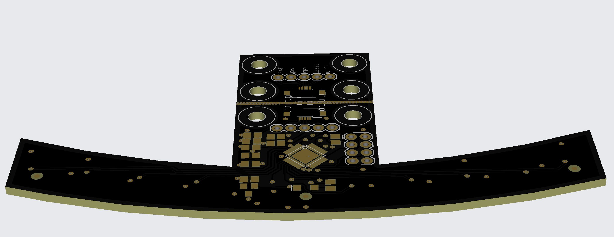
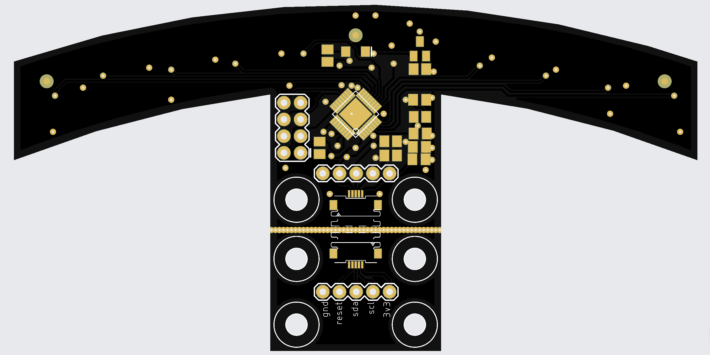
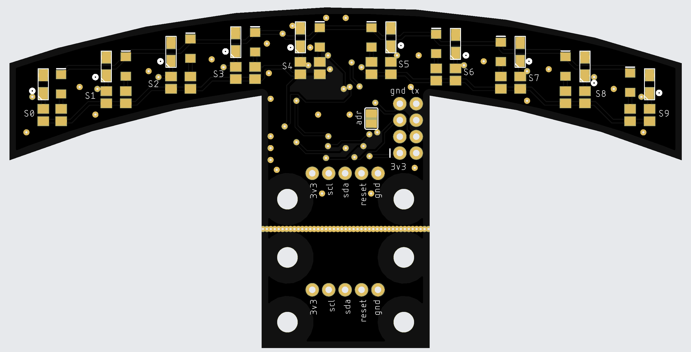
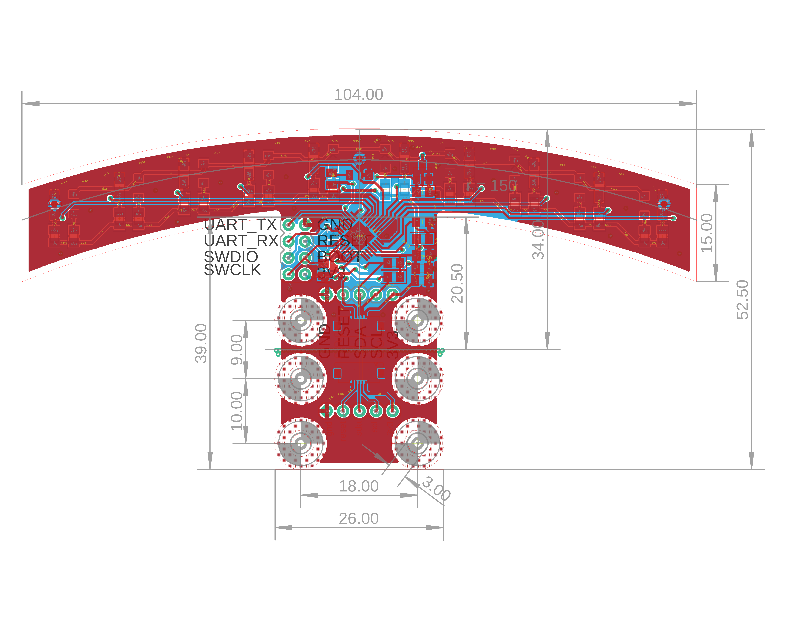

# i2c sensor for line follower

- 10x analog readed sensor
- stm32f051 48MHz arm cortex m0 mcu
- i2c interface, with FFC cable
- uart, swdio availible for debug







# usage

## compiling firmware

- arm-none-eabi-gcc is required

```bash
cd firmware
make clean
make
```

## writing into flash

- use st-link for write firmware
- connect gnd, swclk, swdio and reset to debug connector
- execture **st-flash --connect-under-reset write build.bin 0x8000000**

```bash
cd firmware/bin
./arm_burn
```